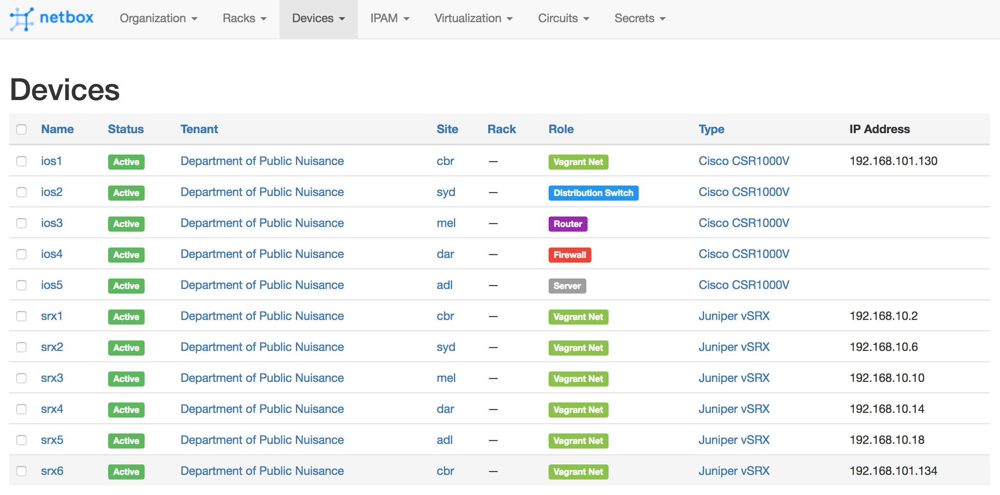
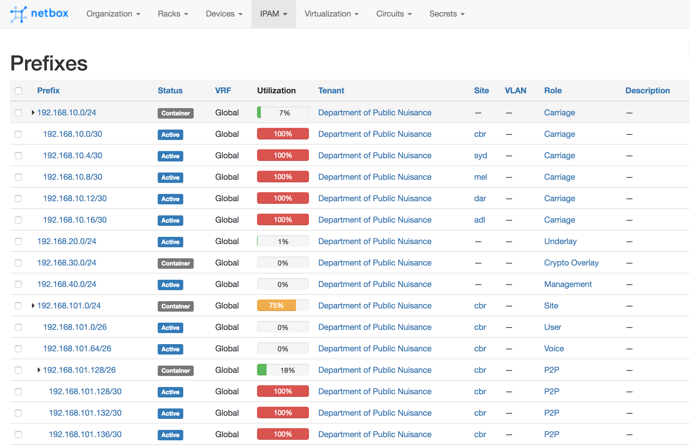
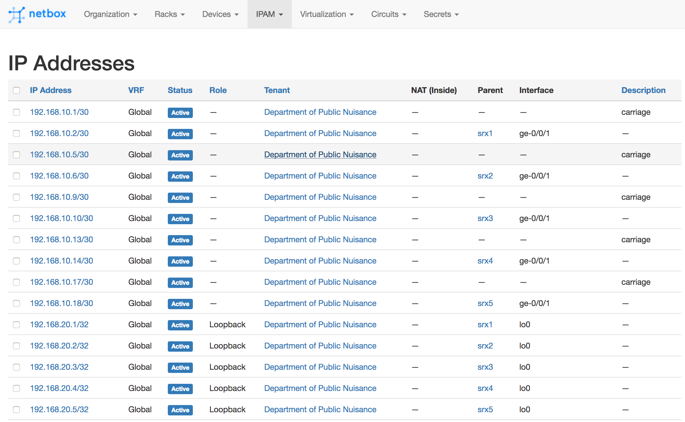

# Generate Vagrantfile topology based upon Netbox IPAM data in a Saltstack environment.

Rather than dusting off an old gns3 file or manually carving out a Vagrantfile each
time I want to build a test a topology or a technology, I thought it would be nice
to build it automatically for use in Vagrant, using the source of truth for the
environment - the IPAM.

## Usage
* Clone repo to salt folder
* Set up pillar with vagrant user and output_folder
* Set up Netbox topology with:
    * devices
    * device types
    * device connections
    * circuits
    * circuit terminations
    * Prefixes (inc carrier role if desired)
    * IP addresses (inc carrier description if desired)
* vagrant-net device role (or change the templates)
* `sudo salt 'minion' state.apply vagrant_net`
* `cd /<output folder>/<netbox-tenant-name>`
* `vagrant up`

## Requirements:
* Salt bundled with the netbox modules configured with appropriate pillar information (url, token, private_key_file)
* Align vagrant_net_data.jinja box keys with appropriate vagrant boxes and Netbox names (example provided below)
* PE IP addresses for circuit terminations must have roles and description assigned
* Juniper vagrant plugin should be installed for any auto config (https://github.com/JNPRAutomate/vagrant-junos)
* BYO Cisco vagrant boxes as they are not hosted by Hashi. Help on creating them here:  (https://github.com/hpreston/vagrant_net_prog/tree/master/box_building#cisco-csr-1000v)

## Notes:
* Circuits/terminations only needed if simulating MPLS/internet provider outside IPAM (so PE isn't managed in IPAM)
* IP Addresses only needed for Juniper auto config
* At this stage the PE will be created regardless and for every carriage termination,
not just those of the devices in scope. It's on my TODO.
* Maximum of 7 devices connected to PE at this stage. Combined with the above dot
point this is bad.
* The PE currently includes an in-band path to my Salt environment with a static IP
because the next logical step is to manage your lab with Salt :-)
* The default RAM allocated to each VM is 4G mostly for the Cisco devices, but the
vSRX is only given 512MB and seems to work quite well.
* Changing the CSR1000V nic type to `virtio` is specifically for versions >=16.7,
change as appropriate.
* TODO: Buy more RAM

### Example Pillar:
```
vagrant:
    username: vagrant
    output_folder: /srv/salt/output/vagrant_net
```
### Example box dictionary:
Keys must match Netbox device type slug
```

```
## Example Netbox data with resulting Vagrantfile
The following images are screencaps from a Netbox instance which is being accessed
by Saltstack through vagrant_net to generate a Vagrantfile.

### Netbox Devices
Devices in scope are configured with the appropriate Netbox role. In this case it
will include 8 devices, 6x of which are vSRX, 1x CSR1kv and 1x vSRX PE (not seen)
in Netbox.



### Netbox Prefixes and IP addresses

#### Note:
The only prefixes needed by this template are those marked with the carriage role.




### Netbox Device Connections
Connections view from the context of srx1, one circuit terminate to carriage, one
to device connection to ios1 and one to srx6.


### Netbox Device Types
API output of Netbox device types with irrelevant data snipped for brevity:

```
{
  "count": 3,
  "next": null,
  "previous": null,
  "results": [
    {
      "id": 3,
      "manufacturer": {
        "id": 2,
        "name": "Cisco",
        "slug": "cisco"
      },
      "model": "CSR1000V",
      "slug": "csr1000v",
<snip>
    },
    {
      "id": 4,
      "manufacturer": {
        "id": 2,
        "name": "Cisco",
        "slug": "cisco"
      },
      "model": "Nexus9Kv",
      "slug": "nexus9kv",
<snip>
    },
    {
      "id": 1,
      "manufacturer": {
        "id": 5,
        "name": "Juniper",
        "slug": "juniper"
      },
      "model": "vSRX",
      "slug": "vsrx",
<snip>
    }
  ]
}
```

### Resulting Vagrantfile

```
# -*- mode: ruby -*-
# vi: set ft=ruby :

# For Juniper devices, ge-0/0/0.0 defaults to NAT for SSH + management
# connectivity over Vagrant's forwarded ports. This should configure
# ge-0/0/1.0 through ge-0/0/7.0 on VirtualBox.

# ENV['VAGRANT_DEFAULT_PROVIDER'] = 'vmware_fusion'
Vagrant.configure(2) do |config|
    config.vm.provider "virtualbox" do |vb|
        vb.cpus = 2
        vb.gui = false
        vb.memory = "4096"
    end

    config.vm.provider "vmware_fusion" do |vf|
        vf.memory = 512
        vf.cpus = 2
        vf.gui = false
    end
    config.vm.define "srx1" do |srx1|
            srx1.vm.box = "juniper/ffp-12.1X47-D15.4-packetmode"
            srx1.ssh.insert_key = false
            srx1.vm.boot_timeout = 240
            srx1.vm.synced_folder '.', '/vagrant', disabled: true
            if Vagrant.has_plugin?("vagrant-vbguest")
              config.vbguest.auto_update = false
            end
            srx1.vm.hostname = "srx1"
            srx1.vm.provider "virtualbox" do |srx1v|
              srx1v.memory = 512
            end
            srx1.vm.network "private_network",
                                ip: "192.168.10.2",
                                netmask: "255.255.255.252",
                                virtualbox__intnet: "pe-srx1"
            srx1.vm.network "private_network",
                                ip: "192.168.101.129",
                                netmask: "255.255.255.252",
                                virtualbox__intnet: "srx1-ios1"
            srx1.vm.network "private_network",
                                ip: "192.168.101.133",
                                netmask: "255.255.255.252",
                                virtualbox__intnet: "srx1-srx6"
    end
    config.vm.define "srx2" do |srx2|
            srx2.vm.box = "juniper/ffp-12.1X47-D15.4-packetmode"
            srx2.ssh.insert_key = false
            srx2.vm.boot_timeout = 240
            srx2.vm.synced_folder '.', '/vagrant', disabled: true
            if Vagrant.has_plugin?("vagrant-vbguest")
              config.vbguest.auto_update = false
            end
            srx2.vm.hostname = "srx2"
            srx2.vm.provider "virtualbox" do |srx2v|
              srx2v.memory = 512
            end
            srx2.vm.network "private_network",
                                ip: "192.168.10.6",
                                netmask: "255.255.255.252",
                                virtualbox__intnet: "pe-srx2"
    end
    config.vm.define "srx3" do |srx3|
            srx3.vm.box = "juniper/ffp-12.1X47-D15.4-packetmode"
            srx3.ssh.insert_key = false
            srx3.vm.boot_timeout = 240
            srx3.vm.synced_folder '.', '/vagrant', disabled: true
            if Vagrant.has_plugin?("vagrant-vbguest")
              config.vbguest.auto_update = false
            end
            srx3.vm.hostname = "srx3"
            srx3.vm.provider "virtualbox" do |srx3v|
              srx3v.memory = 512
            end
            srx3.vm.network "private_network",
                                ip: "192.168.10.10",
                                netmask: "255.255.255.252",
                                virtualbox__intnet: "pe-srx3"
    end
    config.vm.define "srx4" do |srx4|
            srx4.vm.box = "juniper/ffp-12.1X47-D15.4-packetmode"
            srx4.ssh.insert_key = false
            srx4.vm.boot_timeout = 240
            srx4.vm.synced_folder '.', '/vagrant', disabled: true
            if Vagrant.has_plugin?("vagrant-vbguest")
              config.vbguest.auto_update = false
            end
            srx4.vm.hostname = "srx4"
            srx4.vm.provider "virtualbox" do |srx4v|
              srx4v.memory = 512
            end
            srx4.vm.network "private_network",
                                ip: "192.168.10.14",
                                netmask: "255.255.255.252",
                                virtualbox__intnet: "pe-srx4"
    end
    config.vm.define "srx5" do |srx5|
            srx5.vm.box = "juniper/ffp-12.1X47-D15.4-packetmode"
            srx5.ssh.insert_key = false
            srx5.vm.boot_timeout = 240
            srx5.vm.synced_folder '.', '/vagrant', disabled: true
            if Vagrant.has_plugin?("vagrant-vbguest")
              config.vbguest.auto_update = false
            end
            srx5.vm.hostname = "srx5"
            srx5.vm.provider "virtualbox" do |srx5v|
              srx5v.memory = 512
            end
            srx5.vm.network "private_network",
                                ip: "192.168.10.18",
                                netmask: "255.255.255.252",
                                virtualbox__intnet: "pe-srx5"
    end
    config.vm.define "srx6" do |srx6|
            srx6.vm.box = "juniper/ffp-12.1X47-D15.4-packetmode"
            srx6.ssh.insert_key = false
            srx6.vm.boot_timeout = 240
            srx6.vm.synced_folder '.', '/vagrant', disabled: true
            if Vagrant.has_plugin?("vagrant-vbguest")
              config.vbguest.auto_update = false
            end
            srx6.vm.hostname = "srx6"
            srx6.vm.provider "virtualbox" do |srx6v|
              srx6v.memory = 512
            end
            srx6.vm.network "private_network",
                                ip: "192.168.101.134",
                                netmask: "255.255.255.252",
                                virtualbox__intnet: "srx1-srx6"
            srx6.vm.network "private_network",
                                ip: "192.168.101.138",
                                netmask: "255.255.255.252",
                                virtualbox__intnet: "ios1-srx6"
    end
    config.vm.define "ios1" do |ios1|
            ios1.vm.box = "iosxe/16.07.01"
            ios1.ssh.insert_key = false
            ios1.vm.boot_timeout = 240
            ios1.vm.synced_folder '.', '/vagrant', disabled: true
            if Vagrant.has_plugin?("vagrant-vbguest")
              config.vbguest.auto_update = false
            end
            ios1.vm.network "private_network",
                                nic_type: "virtio",
                                auto_config: false,
                                virtualbox__intnet: "srx1-ios1"
            ios1.vm.network "private_network",
                                nic_type: "virtio",
                                auto_config: false,
                                virtualbox__intnet: "ios1-srx6"
    end
    config.vm.define "pe" do |pe|
            pe.vm.hostname = "pe"
            pe.vm.box = "juniper/ffp-12.1X47-D15.4-packetmode"
            pe.vm.network "private_network",
                                ip: "192.168.10.1",
                                netmask: "255.255.255.252",
                                virtualbox__intnet: "pe-srx1"
            pe.vm.network "private_network",
                                ip: "192.168.10.5",
                                netmask: "255.255.255.252",
                                virtualbox__intnet: "pe-srx2"
            pe.vm.network "private_network",
                                ip: "192.168.10.9",
                                netmask: "255.255.255.252",
                                virtualbox__intnet: "pe-srx3"
            pe.vm.network "private_network",
                                ip: "192.168.10.13",
                                netmask: "255.255.255.252",
                                virtualbox__intnet: "pe-srx4"
            pe.vm.network "private_network",
                                ip: "192.168.10.17",
                                netmask: "255.255.255.252",
                                virtualbox__intnet: "pe-srx5"
            # Salt Management Path
            pe.vm.network "private_network",
                                ip: "172.16.254.21",
                                netmask: "255.255.255.0"
    end
end
```
